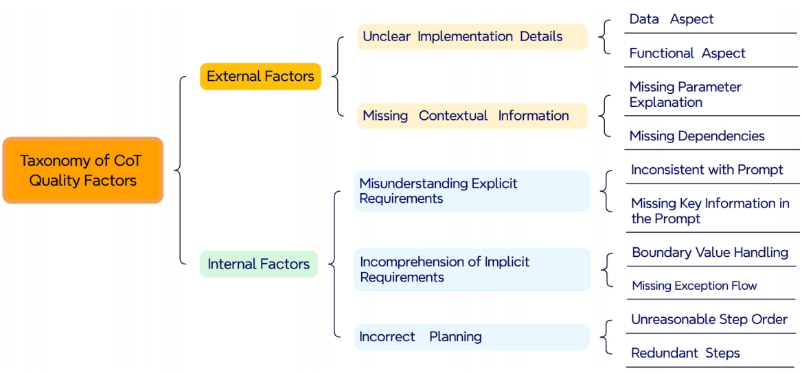

# Are They All Good? Evaluating the Quality of CoTs in LLM-based Code Generation
This is a replication package for Are They All Good? Evaluating the Quality of CoTs in LLM-based Code Generation.

# Project Summary
Large language models (LLMs) have demonstrated impressive performance in code generation, particularly when augmented with chain-of-thought (CoT) prompting techniques. They break down requirements into intermediate reasoning steps, which act as design rationales to guide LLMs in writing code like human programmers. Thus, the quality of these steps is crucial for ensuring the correctness and reliability of the generated code. However, little is known about the quality of CoT generated by LLMs. To what extent can we trust the thoughts generated by LLMs? How good are they? This paper empirically explores the external and internal factors of why LLMs generate unsatisfactory CoTs by analyzing 1,023 failed code samples on two widely used code generation benchmarks. We also evaluate their impact on code generation performance by analyzing 210 CoT-code pairs and refining the unsatisfied CoTs by prompting LLMs.
Our study yields the following findings: 1) Among the factors affecting CoT quality, external factors account for 53.60%, primarily including unclear requirements and lack of contextual information. Internal factors make up 40.10%, mainly due to inconsistencies between CoT and prompts caused by LLMs’ misunderstanding of the instructions. 2) Despite CoT being correct, 18.5% of the generated code still contains errors. This is primarily due to LLMs failing to follow instructions, leading to inconsistencies between CoT and the code. Additionally, we found that even when the code is correct, there is an 11.90% chance that the CoT contains errors. 3) Our further research on refining the
low-quality CoTs reveals that LLMs can improve CoT, especially when providing detailed CoT problem information. Our findings shed light on the underlying issues that hinder the effectiveness of CoT in LLM-based code generation, offering valuable insights for enhancing both the reasoning process and the overall reliability of code generation.

# Taxonomy of Factors Influencing CoT Quality


# Project Structure
```text
├── 📁 annotations         #ℹ️Manual annotation results, including DeepSeek-R1, Gemini-2.0-Flash-Thinking, and o1-2024-12-17 on coderEval and SWE-Bench (New Feature).
│   ├── 📁 deepseek-coderEval-analyze-data                     
│   │   └── 📄 deepseek-false-output-[1-17].txt
│   ├── 📁 deepseek-swe-bench-analyze-data
│   │   └── 📄 deepseek-r1-output-[1-19].txt
│   ├── 📁 gemini-coderEval-analyze-data
│   │   └── 📄 gemini-false-output-[1-17].txt
│   ├── 📁 gemini-swe-bench-analyze-data
│   │   └── 📄 gemini-output-[1-19].txt
│   ├── 📁 gpt-coderEval-analyze-data
│   │   └── 📄 o1-false-output-[1-17].txt
│   └── 📁 gpt-swe-bench-analyze-data
│       └── 📄 o1-output-[1-19].txt
├── 📁 codebook            #💡Contains the results of building the codebook
│   └── 📄 codebook.txt
├── 📁 CoT_examples        #💡Taxonomy of factors influencing CoT quality and examples
│   ├── 📓 external_factors_examples.md
│   ├── 📓 internal_factors_examples.md
│   └── 🖼️ taxonomy_CoT.png
├── 📁 LLM_gen_CoT_results #📌DeepSeek-R1, Gemini-2.0-Flash-Thinking, and o1-2024-12-17 generate CoT results on coderEval and SWE-Bench (New Feature)
│   ├── ⚙️ CoderEval_humanLabel_deepseek-r1_solutions.jsonl
│   ├── ⚙️ CoderEval_humanLabel_gemini-2.0-flash-thinking-exp-01-21_solutions_step.jsonl
│   ├── ⚙️ CoderEval_humanLabel_o1-2024-12-17_solutions_steps.jsonl
│   ├── ⚙️ SWE-bench-NF_deepseek-r1_solutions_final.jsonl
│   ├── ⚙️ SWE-bench-NF_gemini-2.0-flash-thinking-exp-01-21_solutions_final.jsonl
│   └── ⚙️ SWE-bench-NF_o1-2024-12-17_solutions_final.jsonl
└── 📁 prompt              #💡Prompt for generating CoT
    └── 📓 prompt.md
